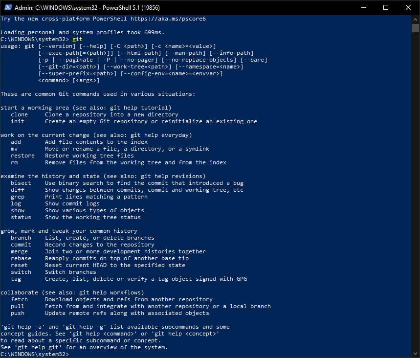
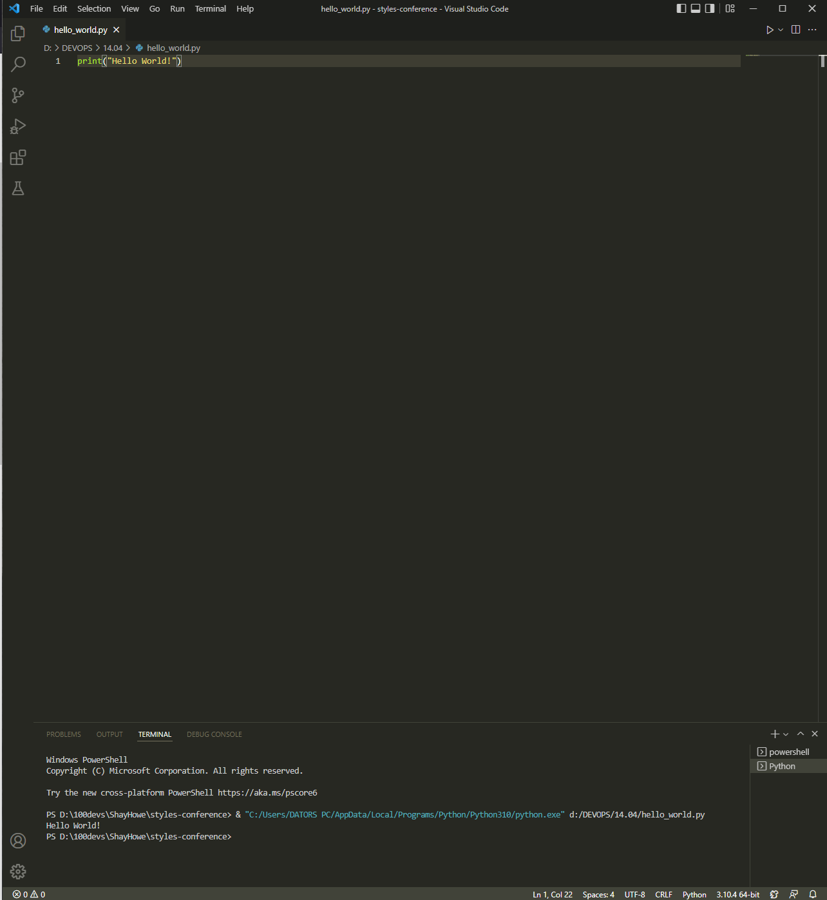

# MD 1.tēma
 _Autors: [Viktors][autors]_
 _Links uz [projektu][projekts]_

# 1.uzdevums:
[saite uz README.md][readme]

# 2.uzdevums:

# 3.uzdevums:

[autors]: <https://github.com/viqslv>
[projekts]: <https://github.com/viqslv/devops_basic_viktorsr>
[readme]: <https://github.com/viqslv/devops_basic_viktorsr/blob/main/README.md>