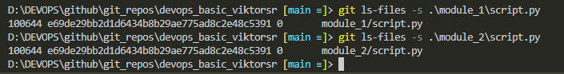

# MD 2.tēma
 _Autors: [Viktors][autors]_
 _Links uz [projektu][projekts]_

# 9.uzdevums:

# 13.uzdevums:

- git neredz atšķirību starp orģinālo script.py un nokopētā script.py

[autors]: <https://github.com/viqslv>
[projekts]: <https://github.com/viqslv/devops_basic_viktorsr>